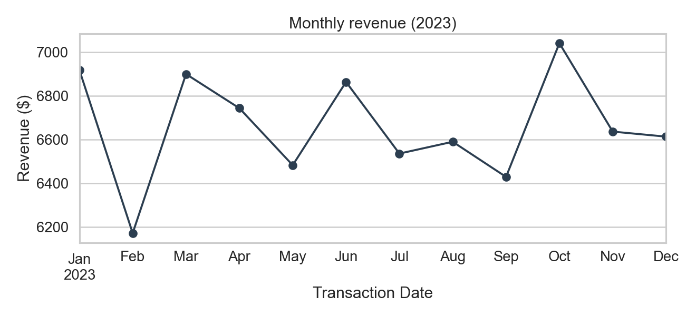
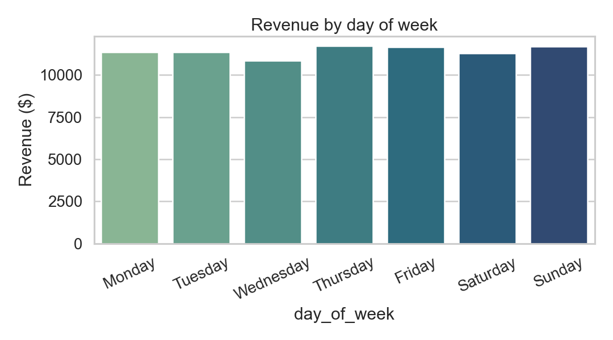
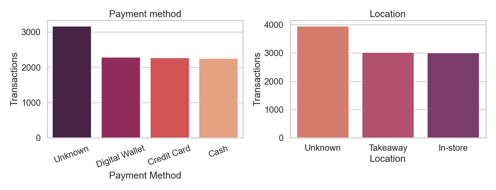

# Cafe Sales — Dirty Data Cleaning + EDA

### 15-minute walkthrough

**jack2000-dev** · April 2026
Source: `ahmedmohamed2003/cafe-sales-dirty-data-for-cleaning-training` (Kaggle)

<!--
Speaker notes:
Hi everyone. 15 minutes covering how I cleaned a deliberately corrupted Kaggle cafe sales dataset and what the EDA found. Two sections: cleaning strategy (8 min), EDA findings (5 min), wrap + Q&A (2 min).
The key idea I want to land: when a dataset has structure, deterministic rules beat statistical imputation. Less guessing, more recovery.
-->

---

## Agenda — 15 min

<div class="tight">

1. **The problem** (2 min) — what "dirty" actually means here
2. **Audit** (2 min) — value-token level, not just `isnull()`
3. **Cleaning strategy** (4 min) — deterministic > statistical
4. **Recovery results** (1 min) — what the rules bought us
5. **EDA findings** (4 min) — revenue, time, mix
6. **Limitations + takeaways** (2 min)

</div>

<!--
Hold yourself to the budget. The audit and cleaning are the meat — most of the analytical thinking happened there. EDA findings are mostly negative results because the dataset is synthetic, so don't oversell.
-->

---

## 1. The problem

**Given:** 10,000-row CSV of cafe transactions. 8 columns: ID, Item, Quantity, Price/Unit, Total, Payment, Location, Date.

**Catch:** dataset deliberately corrupted with mixed missingness.

```
TXN_4271903 | Cookie  | 4 | 1.0   | ERROR    | Credit Card    | In-store | 2023-07-19
TXN_7034554 | Salad   | 2 | 5.0   | 10.0     | UNKNOWN        | UNKNOWN  | 2023-04-27
TXN_4433211 | UNKNOWN | 3 | 3.0   | 9.0      | ERROR          | Takeaway | 2023-10-06
```

**Goal:** produce a clean CSV + EDA report we'd actually trust.

<!--
Walk one sample row out loud. Note that Total Spent is *literally* the string "ERROR" — that's why naive `df["Total Spent"].astype(float)` would crash. Three rows shown demonstrate three different failure modes.
-->

---

## 2. Audit — value-token level

`df.isna().sum()` undercounts. The dataset uses **three** missingness forms:

| Form | Count strategy |
|------|----------------|
| Real `NaN` | `df.isna().sum()` |
| String `"ERROR"` | `(df.astype(str) == "ERROR").sum()` |
| String `"UNKNOWN"` | `(df.astype(str) == "UNKNOWN").sum()` |

Worst-affected columns:

| Column | NaN | ERROR + UNKNOWN | Total dirty |
|--------|----:|----------------:|-----------:|
| Location | 3,265 | 696 | **3,961 (40%)** |
| Payment Method | 2,579 | 599 | **3,178 (32%)** |
| Item | 333 | 636 | **969 (10%)** |

<!--
Drive home: ALWAYS audit at the value level on an unfamiliar dataset. The first time I just ran `isnull()` here I missed 6,200+ dirty cells across the dataset.
Numerics also stored as strings because of mixed sentinels — explain why this matters for dtype coercion.
-->

---

## 3. Cleaning strategy — the key call

**Don't reach for `fillna(mean)` first.** Look for *structure*.

Two structural facts in this dataset:

1. **Each menu item has exactly one price.** Verified: `df.groupby("Item")["Price"].nunique() == 1` for all 8 items.
2. **`Total = Quantity × Price`** is an algebraic identity. Any one of the three is recoverable when the other two are present.

Combined: a deterministic recipe, no guessing.

<!--
This slide is the punchline of the talk. If you only remember one thing: structure-first cleaning > statistical cleaning when structure exists. Statistical fills are for when you've already exhausted the deterministic ones.
-->

---

## 3a. The item–price map

```python
ITEM_PRICE = {
    "Coffee": 2.0, "Tea": 1.5, "Cookie": 1.0, "Cake": 3.0,
    "Juice": 3.0, "Sandwich": 4.0, "Smoothie": 4.0, "Salad": 5.0,
}
```

**Asymmetric:** `Item → Price` is unique. `Price → Item` is *not*.
- $3 → Cake **or** Juice
- $4 → Sandwich **or** Smoothie

Implication: only impute `Item` from `Price` when the price is unambiguous (`$1, $1.50, $2, $5`). Don't "fix" the ambiguous cases with `mode()` — that's silent guessing.

<!--
The asymmetry call is the most senior judgment in the whole pipeline. A junior who doesn't notice it will silently inflate one of (Cake, Juice) at the expense of the other. Flagging it explicitly in the process report is the kind of thing that distinguishes "correct" from "merely working".
-->

---

## 3b. Order of fills

```
1. NaN sentinels       "ERROR" / "UNKNOWN"  →  np.nan
2. Coerce dtypes       to_numeric / to_datetime  (errors="coerce")
3. Price ← Item        from ITEM_PRICE map                (479 cells)
4. Item ← Price        only where price is unambiguous    (468 cells)
5. Total ← Qty × Price                                    (479 cells)
6. Qty ← Total / Price (rounded)                          (456 cells)
7. Price ← Total / Qty                                    ( 48 cells)
8. Categorical fill    "Unknown" literal (preserve row)
9. Dtype fix           Quantity → Int64 (nullable)
```

Each step expands the population of fully-derived rows for the next step.

<!--
Mention the categorical-fill choice: I picked "Unknown" string over dropna(). Reason: those rows still carry valid revenue and item info. Dropping costs ~30-40% of the dataset for any analysis that doesn't need Payment/Location.
Mention Int64: plain int can't hold NaN, residuals are ~23 cells, switching dtype would crash.
-->

---

## 4. Recovery results

| Step | Cells filled |
|------|-------------:|
| Price filled from Item (lookup) | **479** |
| Item filled from Price (unambiguous) | **468** |
| Total derived from Qty × Price | **479** |
| Qty derived from Total / Price | **456** |
| Price derived from Total / Qty | **48** |
| **Total numeric/categorical recovered** | **~1,930** |

**Residual NaN after cleaning:** Item 501 · Qty 23 · Price 6 · Total 23 · Date 460
Single-digit on the numerics. The remaining `Item` gaps are the $3 / $4 ambiguous prices — provably unrecoverable.

<!--
This is the metric to point at when someone asks "did the cleaning work". ~1,930 cells recovered without a single statistical guess. The residual gaps are honest: each one has a structural reason it couldn't be filled.
-->

---

## 5. EDA — revenue ≠ volume

| Item | Units | Revenue | $/unit |
|------|------:|--------:|-------:|
| **Salad** | 3,815 | **$19,075** | $5.00 |
| Sandwich | 3,429 | $13,716 | $4.00 |
| Smoothie | 3,336 | $13,344 | $4.00 |
| Juice | 3,505 | $10,515 | $3.00 |
| Cake | 3,468 | $10,404 | $3.00 |
| **Coffee** | **3,878** | $7,756 | $2.00 |
| Tea | 3,622 | $5,433 | $1.50 |
| Cookie | 3,585 | $3,585 | $1.00 |

Coffee leads units. Salad leads revenue by 2.5×. Volume KPI ≠ revenue KPI.

<!--
Classic price-mix story: the cheapest item is the volume leader and the price tail does most of the revenue work. If a stakeholder asked "what's our hero product" the answer differs depending on which lens they want.
-->

---

## 5a. EDA — time patterns



Revenue holds in a tight **$6.2k–$7.0k band** all year. Coefficient of variation ~3%. **No seasonality.**

<!--
Important caveat: this is almost certainly an artifact of the dataset's synthetic generator, not a real café pattern. Say so explicitly. Don't let stakeholders walk away thinking "cafés have no seasonality".
-->

---

## 5b. EDA — day-of-week + mix

<div style="display: flex; gap: 20px;">





</div>

- **Day of week:** $10.9k–$11.7k. Near-uniform.
- **Payment:** Cash / Card / Wallet ≈ 2.3k each (after stripping `Unknown`).
- **Location:** Takeaway ≈ In-store ≈ 3.0k each.

<!--
Same caveat: the uniformity is suspicious in real-world terms. The "Unknown" buckets (32% Payment, 40% Location) limit segmentation power — say so before someone runs a regression on these splits.
-->

---

## 6. Key insights — three takeaways

1. **Structure-first cleaning recovered ~1,930 cells** with zero statistical imputation. Lookup map + algebraic identity did the work.
2. **Salad earns more than Coffee sells.** Volume KPIs and revenue KPIs disagree on this menu — choose deliberately.
3. **The "no seasonality" finding is not a finding.** It reflects a synthetic generator. Don't extrapolate.

<!--
End on the meta-insight: knowing what *isn't* a finding is part of the job. Surfacing the synthetic-data flatness up front saves a stakeholder from making a bad call later.
-->

---

## 7. Limitations + open questions

**Limitations**
- 32% / 40% `Unknown` in Payment / Location — segmentation along these dims is noisy
- 501 rows with NaN `Item` (the $3 / $4 prices) — excluded from revenue-by-item
- 460 rows with unparseable dates — excluded from time analysis

**Open for review**
- Should rows with `Item = NaN` be shown as a separate "Unknown" bar in revenue charts? (transparency vs. clutter)
- Treat the no-seasonality finding as worth reporting at all, given synthetic origin?

<!--
The "open questions" section is the thing I want a senior reviewer to weigh in on. Showing them where I'm uncertain is more useful than pretending I'm not.
-->

---

## Reproducing

```bash
uv sync
uv run python scripts/pipeline.py            # CLI: clean + EDA + figures
uv run jupyter nbconvert --to notebook \
    --execute notebooks/cafe_eda.ipynb \
    --output cafe_eda.ipynb                   # notebook with embedded outputs
```

**Files**
- `scripts/pipeline.py` — source of truth (~250 lines)
- `notebooks/cafe_eda.ipynb` — narrative version
- `reports/REPORT_TEMPLATE.md` — final report
- `reports/PROCESS_REPORT.md` — junior → senior write-up
- `visuals/*.png` — 8 figures

<!--
Mention CLAUDE.md briefly if asked: future agents working on this repo get a guide to the cleaning logic so the load-bearing facts (sentinels, asymmetric maps, Int64) survive handoff.
-->

---

# Questions?

Repo: `cafe-data-cleaning`
Reports: `/reports/REPORT_TEMPLATE.md` · `/reports/PROCESS_REPORT.md`
Notebook: `/notebooks/cafe_eda.ipynb`

<!--
Likely questions to anticipate:
1. "Why not use sklearn imputers?" — they would have worked but added 0 information; deterministic rules already saturated what was recoverable.
2. "Why keep 'Unknown' as a category?" — preserves rows with valid revenue/item; dropna would discard 30-40% of dataset.
3. "How would this scale to 10M rows?" — same logic, but pipeline.py uses pandas; would swap to polars or chunked pandas. Audit step is O(n*sentinel_count) which is fine.
4. "What if item prices weren't fixed?" — the deterministic recipe collapses; I'd fall back to per-time-window imputation or accept higher residual NaN.
-->
